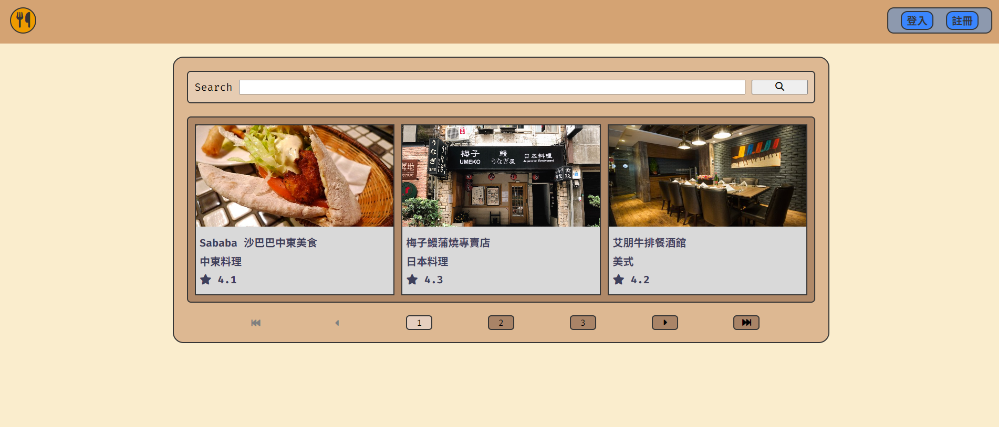

# 我的餐廳清單



## 介紹

紀錄屬於自己的餐廳清單，可以瀏覽餐廳、查看詳細資訊、甚至連結到地圖。

### 功能

- 查看所有餐廳
- 瀏覽餐廳的詳細資訊
- 連結餐廳的地址到 Google 地圖
- 搜尋特定餐廳
- 新增餐廳
- 編輯餐廳
- 刪除餐廳
- 註冊帳號、登入、登出
- 第三方登入 Facebook login

### 備註(與作業範本不同之處)

- 註冊及登入由header的登入/註冊modal完成
- 新增會員後台(在登入後的頭像下拉選單裡)
- 新增餐廳由下拉選單(撰寫)前往
- 編輯/刪除功能要在會員後台的餐廳列表前往

### 額外增添功能

- 搜尋及分頁連動, 查詢結果如有第二頁以上, 分頁連結不會取消關鍵字
- 餐廳detail增添previous跟next箭頭, 可以直接導向下一篇餐廳detail
- 餐廳detail的返回鍵非強制回到首頁第1頁, 而是回到進入detail前的頁面

## 開始使用

1. 請先確認有安裝 node.js, npm
2. 將專案 clone 到本地
3. 在本地開啟之後，透過終端機進入資料夾，輸入：

   ```bash
   npm install
   ```
4. 可以擇一以下方式確認環境變數NODE_ENV=development：

   Power Shell

   ```bash
   $env:NODE_ENV = "development"
   echo $env:NODE_ENV
   ```

   CMD

   ```bash
   set NODE_ENV=development
   echo %NODE_ENV%
   ```

   Git Bash

   ```bash
   export NODE_ENV=development
   echo $NODE_ENV
   ```

5. 在root資料夾創立包含以下資訊的.env檔：

    ```bash
    SESSION_SECRET=XXXXXX
    FACEBOOK_CLIENT_ID=XXXXXXXXXXXXXXX
    FACEBOOK_CLIENT_SECRET=XXXXXXXXXXXXXXXXXXXXXXXXXXXXXXXX
    FACEBOOK_CALLBACK_URL=http://localhost:3000/auth/redirect/facebook
    ```

6. 請在./config/config.json設置MySQL的帳號及密碼，再依序輸入：

    如Mysql已存在名為restaurants的db,無須執行`npm run db`

   ```bash
   npm run db
   npm run seed
   npm run start
   ```

7. 若看見此行訊息則代表順利運行，打開瀏覽器進入到以下網址：

   ```bash
   http://localhost:3000/restaurants
   ```

8. 若欲暫停使用：

   ```bash
   ctrl + c
   ```
9. 預設帳號資訊：

   1. 名稱: null

      信箱: user1@example.com

      密碼: 12345678

      餐廳: 1, 2, 3

   2. 名稱: null

      信箱: user2@example.com

      密碼: 12345678

      餐廳: 4, 5, 6

   2. 名稱: alex

      信箱: alex@gmail.com

      密碼: alex5678

      餐廳: 7, 8

## 開發工具

- Node.js 20.11.0
- Express 4.19.2
- Express-Handlebars 7.1.2
- Font-Awesome 6.5.2
- MySQL2 3.9.7
- Bcrypt 5.1.1
- Connect-Flash 0.1.1
- Dotenv 16.4.5
- Express-Session 1.18.0
- Method-Override 3.0.0
- Passport 0.7.0
- Passport-Facebook 3.0.0
- Passport-Local 1.0.0
- Sequelize 6.37.3
- Sequelize-Cli 6.6.2
